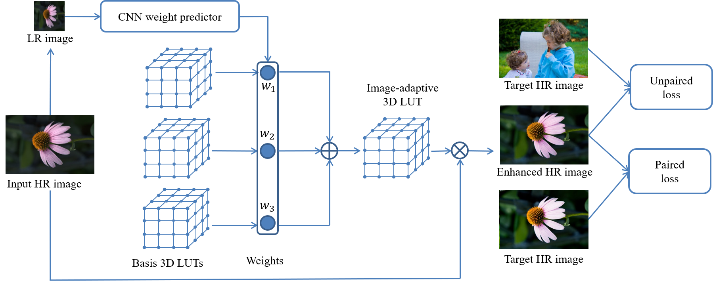

# Image-Adaptive-3DLUT
Learning Image-adaptive 3D Lookup Tables for High Performance Photo Enhancement in Real-time

## Downloads
### [Paper](https://www4.comp.polyu.edu.hk/~cslzhang/paper/PAMI_LUT.pdf), [Supplementary](https://www4.comp.polyu.edu.hk/~cslzhang/paper/Supplement_LUT.pdf), Datasets([[GoogleDrive](https://drive.google.com/drive/folders/1Y1Rv3uGiJkP6CIrNTSKxPn1p-WFAc48a?usp=sharing)],[[onedrive](https://connectpolyu-my.sharepoint.com/:f:/g/personal/16901447r_connect_polyu_hk/EqNGuQUKZe9Cv3fPG08OmGEBbHMUXey2aU03E21dFZwJyg?e=QNCMMZ)],[[baiduyun](https://pan.baidu.com/s/1CsQRFsEPZCSjkT3Z1X_B1w):5fyk]), [PCT patent]
The whole datasets used in the paper are over 300G. Here I only provided the FiveK dataset resized into 480p resolution (including 8-bit sRGB, 16-bit XYZ inputs and 8-bit sRGB targets). I also provided 10 full-resolution images for testing speed. To obtain the entire full-resolution images, it is recommended to convert from the original [FiveK](https://data.csail.mit.edu/graphics/fivek/) dataset.

A model trained on the 480p resolution can be directly applied to images of 4K (or higher) resolution without performance drop. This can significantly speedup the training stage without loading the very heavy high-resolution images.

## Abstract
Recent years have witnessed the increasing popularity of learning based methods to enhance the color and tone of photos. However, many existing photo enhancement methods either deliver unsatisfactory results or consume too much computational and memory resources, hindering their application to high-resolution images (usually with more than 12 megapixels) in practice. In this paper, we learn image-adaptive 3-dimensional lookup tables (3D LUTs) to achieve fast and robust photo enhancement. 3D LUTs are widely used for manipulating color and tone of photos, but they are usually manually tuned and fixed in camera imaging pipeline or photo editing tools. We, for the first time to our best knowledge, propose to learn 3D LUTs from annotated data using pairwise or unpaired learning. More importantly, our learned 3D LUT is image-adaptive for flexible photo enhancement. We learn multiple basis 3D LUTs and a small convolutional neural network (CNN) simultaneously in an end-to-end manner. The small CNN works on the down-sampled version of the input image to predict content-dependent weights to fuse the multiple basis 3D LUTs into an image-adaptive one, which is employed to transform the color and tone of source images efficiently. Our model contains less than **600K** parameters and takes **less than 2 ms** to process an image of 4K resolution using one Titan RTX GPU. While being highly efficient, our model also outperforms the state-of-the-art photo enhancement methods by a large margin in terms of PSNR, SSIM and a color difference metric on two publically available benchmark datasets.

## Framework


## Usage

### Requirements
Python3, requirements.txt

### Build
By default, we use pytorch 0.4.1:

    cd trilinear_c
    sh make.sh

For pytorch 1.x:

    cd trilinear_cpp
    sh setup.sh

Please also replace the following lines:
```
# in image_adaptive_lut_train_paired.py, image_adaptive_lut_evaluation.py, demo_eval.py, and image_adaptive_lut_train_unpaired.py
from models import * --> from models_x import *
# in demo_eval.py
result = trilinear_(LUT, img) --> _, result = trilinear_(LUT, img)
# in image_adaptive_lut_train_paired.py and image_adaptive_lut_evaluation.py
combine_A = trilinear_(LUT,img) --> _, combine_A = trilinear_(LUT,img)
```

### Training
#### paired training
     python3 image_adaptive_lut_train_paired.py
#### unpaired training
    python3 image_adaptive_lut_train_unpaired.py

### Evaluation
1. use python to generate and save the test images:

       python3 image_adaptive_lut_evaluation.py

speed can also be tested in above code.

2. use matlab to calculate the indexes used in our paper:

       average_psnr_ssim.m

### Demo

    python3 demo_eval.py

### Tools
1. You can generate identity 3DLUT with arbitrary dimension by using `utils/generate_identity_3DLUT.py` as follows:

```
# you can replace 33 with any number you want
python3 utils/generate_identity_3DLUT.py -d 33
```

2. You can visualize the learned 3D LUT either by using the matlab code in `visualization_lut` or using the python code `utils/visualize_lut.py` as follows:

```
python3 utils/visualize_lut.py path/to/your/lut
# you can also modify the dimension of the lut as follows
python3 utils/visualize_lut.py path/to/your/lut --lut_dim 64
```

## Citation
```
@article{zeng2020lut,
  title={Learning Image-adaptive 3D Lookup Tables for High Performance Photo Enhancement in Real-time},
  author={Zeng, Hui and Cai, Jianrui and Li, Lida and Cao, Zisheng and Zhang, Lei},
  journal={IEEE Transactions on Pattern Analysis and Machine Intelligence},
  volume={},
  number={},
  pages={},
  year={2020},
  publisher={IEEE}
}
```
